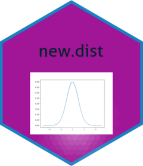

<!-- README.md is generated from README.Rmd. Please edit that file -->

# new.dist

<!-- badges: start -->

[](https://github.com/akmn35/new.dist/actions/workflows/R-CMD-check.yaml)
[](https://www.gnu.org/licenses/gpl-3.0.en.html)
[](https://github.com/akmn35/new.dist)
<!-- badges: end -->

The aim is to develop an R package, which is new.dist package, for the
probability (density) function, the distribution function, the quantile
function and the associated random number generation function for
discrete and continuous distributions, which have recently been proposed
in the literature. This package implements the following distributions:
The Power Muth Distribution, A bimodal Weibull Distribution, The
Discrete Lindley Distribution, The Gamma-Lomax Distribution, Weighted
Geometric Distribution, A Power Log-Dagum Distribution, Kumaraswamy
Distribution, Lindley Distribution, The Unit-Inverse Gaussian
Distribution, EP Distribution, Akash Distribution, Ishita Distribution,
Maxwell Distribution, The Standard Omega Distribution, Slashed
Generalized Rayleigh Distribution, Two-Parameter Rayleigh Distribution,
Muth Distribution, Uniform-Geometric Distribution, Discrete Weibull
Distribution.

## Installation

You can install the development version of new.dist from
\[GitHub\]\[<https://github.com/>\] with:

``` r
# install.packages("devtools")
devtools::install_github("akmn35/new.dist")
```

## Details

`new.dist` Density, distribution function, quantile function and random
generation for parameter estimation of distributions.

## Example

`dbwd` Density function for Bimodal Weibull distribution with shape
(alpha) and scale (beta) parameters.

``` r
library(new.dist)
dbwd(1,alpha=2,beta=3,sigma=4)
#> [1] 0.01594262
```

`pbwd` Distribution function for Bimodal Weibull distribution with shape
(alpha) and scale (beta) parameters.

``` r
library(new.dist)
pbwd(1,alpha=2,beta=3,sigma=4)
#> [1] 0.003859685
```

`qbwd` Quantile function for Bimodal Weibull distribution with shape
(alpha) and scale (beta) parameters.

``` r
library(new.dist)
qbwd(.7,alpha=2,beta=3,sigma=4)
#> [1] 4.759942
```

`rbwd` Random generation for a Bimodal Weibull distribution with shape
(alpha) and scale (beta) parameters.

``` r
library(new.dist)
rbwd(5,alpha=2,beta=3,sigma=4)
#> [1] 3.432626 2.030858 2.252918 3.764117 4.762715
```

`dsgrd` Density function for a Slashed Generalized Rayleigh distribution
with shape (alpha), scale (theta) and kurtosis(beta) parameters.

``` r
library(new.dist)
dsgrd(2,theta=3,alpha=1,beta=4)
#> [1] 0.08314235
```

`psgrd` Distribution function for a Slashed Generalized Rayleigh
distribution with shape (alpha), scale (theta) and kurtosis (beta)
parameters.

``` r
library(new.dist)
psgrd(5,theta=3,alpha=1,beta=4)
#> [1] 0.9989333
```

`qsgrd` Quantile function for a Slashed Generalized Rayleigh
distribution with shape (alpha), scale (theta) and kurtosis (beta)
parameters.

``` r
library(new.dist)
qsgrd(.4,theta=3,alpha=1,beta=4)
#> [1] 0.8358487
```

`rsgrd` Random generation for a Slashed Generalized Rayleigh
distribution with shape (alpha), scale (theta) and kurtosis (beta)
parameters.

``` r
library(new.dist)
rsgrd(5,theta=3,alpha=1,beta=4)
#> [1] 0.9641649 0.6280363 0.3856982 0.8547346 0.7316044
```

`dsod` Density function for a the Standard Omega distribution with alpha
and beta parameters.

``` r
library(new.dist)
dsod(0.4, alpha=1, beta=2)
#> [1] 0.6986559
```

`psod` Distribution function for a the Standard Omega distribution with
alpha and beta parameters.

``` r
library(new.dist)
psod(0.4, alpha=1, beta=2)
#> [1] 0.1490371
```

`qsod` Quantile function for a the Standard Omega distribution with
alpha and beta parameters.

``` r
library(new.dist)
qsod(.8, alpha=1, beta=2)
#> [1] 0.9607689
```

`rsod` Random generation for a the Standard Omega distribution with
alpha and beta parameters.

``` r
library(new.dist)
rsod(5, alpha=1, beta=2)
#> [1] 0.3292905 0.8697407 0.9020607 0.7494376 0.8683983
```

`dugd` Density function for the Uniform-Geometric distribution with
theta parameter.

``` r
library(new.dist)
dugd(1, theta=0.5)
#> [1] 0.6931472
```

`pugd` Distribution function for the Uniform-Geometric distribution with
theta parameter.

``` r
library(new.dist)
pugd(1,theta=.5)
#> [1] 0.6931472
```

`qugd` Quantile function for the Uniform-Geometric distribution with
theta parameter.

``` r
library(new.dist)
qugd(0.6,theta=.1)
#> [1] 4
```

`rugd` Random generation for the Uniform-Geometric distribution with
theta parameter.

``` r
library(new.dist)
rugd(5,theta=.1)
#> [1]  2  6  5  2 14
```

`dtpmd` Density function for the Power Muth distribution with shape
(beta) and scale (alpha) parameters.

``` r
library(new.dist)
dtpmd(1, beta=2, alpha=3)
#> [1] 0.04952547
```

`ptpmd` Distribution function for the Power Muth distribution shape
(beta) and scale (alpha) parameters.

``` r
library(new.dist)
ptpmd(1,beta=2,alpha=3)
#> [1] 0.008115344
```

`qtpmd` Quantile function for the Power Muth distribution with shape
(beta) and scale (alpha) parameters.

``` r
library(new.dist)
qtpmd(.5,beta=2,alpha=3)
#> [1] 1.990084
```

`rtpmd` Random generation for the Power Muth distribution with shape
(beta) and scale (alpha) parameters.

``` r
library(new.dist)
rtpmd(5,beta=2,alpha=3)
#> [1] 1.741799 2.054245 1.690090 1.718731 1.171386
```

`dtprd` Density function for the Two-Parameter Rayleigh distribution
with location (mu) and scale (lambda) parameters.

``` r
library(new.dist)
dtprd(5, lambda=4, mu=4)
#> [1] 0.1465251
```

`ptprd` Distribution function for Two-Parameter Rayleigh distribution
with location (mu) and scale (lambda) parameters.

``` r
library(new.dist)
ptprd(2,lambda=2,mu=1)
#> [1] 0.8646647
```

`qtprd` Quantile function for Two-Parameter Rayleigh distribution with
location (mu) and scale (lambda) parameters.

``` r
library(new.dist)
qtprd(.5,lambda=2,mu=1)
#> [1] 1.588705
```

`rtprd` Random generation for Two-Parameter Rayleigh distribution with
location (mu) and scale (lambda) parameters.

``` r
library(new.dist)
rtprd(5,lambda=2,mu=1)
#> [1] 2.023360 1.948241 2.650781 1.600043 1.413885
```

`duigd` Density function for the Unit Inverse Gaussian distribution with
mean (mu) and scale (lambda) parameters.

``` r
library(new.dist)
duigd(1, mu=2, lambda=3)
#> [1] 0.4749088
```

`puigd` Distribution function for the Unit Inverse Gaussian distribution
with mean (mu) and scale (lambda) parameters.

``` r
library(new.dist)
puigd(1,mu=2,lambda=3)
#> [1] 0.2873867
```

`quigd` Quantile function for the Unit Inverse Gaussian distribution
with mean (mu) and scale (lambda) parameters.

``` r
library(new.dist)
quigd(.1,mu=2,lambda=3)
#> [1] 0.6104128
```

`ruigd` Random generation for the Unit Inverse Gaussian distribution
with mean (mu) and scale (lambda) parameters.

``` r
library(new.dist)
ruigd(5,mu=2,lambda=3)
#> [1] 3.4431360 5.3324129 0.8574964 0.8465562 1.6292667
```

`dwgd` Density function for the Weighted Geometric distribution with
alpha and lambda parameters.

``` r
library(new.dist)
dwgd(1,alpha=.2,lambda=3)
#> [1] 0.79872
```

`pwgd` Distribution function for the Weighted Geometric distribution
with alpha and lambda parameters.

``` r
library(new.dist)
dwgd(1,alpha=.2,lambda=3)
#> [1] 0.79872
```

`qwgd` Quantile function for the Weighted Geometric distribution with
alpha and lambda parameters.

``` r
library(new.dist)
qwgd(.98,alpha=.2,lambda=3)
#> [1] 3
```

`rwgd` Random generation for the Weighted Geometric distribution with
alpha and lambda parameters.

``` r
library(new.dist)
rwgd(5,alpha=.2,lambda=3)
#> [1] 1 1 2 1 1
```

`ddld` Density function for the Discrete Lindley distribution with theta
parameter.

``` r
library(new.dist)
ddld(1,theta=2)
#> [1] 0.1828223
```

`pdld` Distribution function for the Discrete Lindley distribution with
theta parameter.

``` r
library(new.dist)
ddld(1,theta=2)
#> [1] 0.1828223
```

`qdld` Quantile function for the Discrete Lindley distribution with
theta parameter.

``` r
library(new.dist)
qdld(.993,theta=2)
#> [1] 3
```

`rdld` Random generation for the Discrete Lindley distribution with
theta parameter.

``` r
library(new.dist)
rdld(5,theta=1)
#> [1] 1 5 0 2 1
```

`demd` Density function for Maxwell distribution with scale (theta)
parameter.

``` r
library(new.dist)
demd(1,theta=2)
#> [1] 0.4839414
```

`pemd` Distribution function for a Maxwell distribution with scale
(theta) parameter.

``` r
library(new.dist)
pemd(1,theta=2)
#> [1] 0.198748
```

`qemd` Quantile function for a Maxwell distribution with scale (theta)
parameter.

``` r
library(new.dist)
qemd(.4,theta=5)
#> [1] 2.161694
```

`remd` Random generation for a Maxwell distribution with scale (theta)
parameter.

``` r
library(new.dist)
remd(5,theta=1)
#> [1] 1.1710144 1.3907487 0.9700592 2.0583140 0.8225282
```

`depkd` Density function for Kumaraswamy distribution with shape (alpha,
lambda) parameters.

``` r
library(new.dist)
depkd(0.1,lambda=2,alpha=3)
#> [1] 0.58806
```

`pepkd` Distribution function for Kumaraswamy distribution with shape
(alpha, lambda) parameters.

``` r
library(new.dist)
depkd(0.1,lambda=2,alpha=3)
#> [1] 0.58806
```

`qepkd` Quantile function for Kumaraswamy distribution with shape
(alpha, lambda) parameters.

``` r
library(new.dist)
pepkd(0.5,lambda=2,alpha=3)
#> [1] 0.578125
```

`repkd` Random generation for Kumaraswamy distribution with shape
(alpha, lambda) parameters.

``` r
library(new.dist)
repkd(5,lambda=2,alpha=3)
#> [1] 0.68299746 0.23383112 0.63678392 0.07878292 0.36318421
```

`dgld` Density function for the Gamma-Lomax distribution with shape (a,
alpha) and scale (beta) parameters.

``` r
library(new.dist)
dgld(1,a=2,alpha=3,beta=4)
#> [1] 0.2056491
```

`pgld` Distribution function for the Gamma-Lomax distribution with shape
(a, alpha) and scale (beta) parameters.

``` r
library(new.dist)
dgld(1,a=2,alpha=3,beta=4)
#> [1] 0.2056491
```

`qgld` Quantile function for the Gamma-Lomax distribution with shape (a,
alpha) and scale (beta) parameters.

``` r
library(new.dist)
qgld(.8,a=2,alpha=3,beta=4)
#> [1] 6.852518
```

`rgld` Random generation for the Gamma-Lomax distribution with shape (a,
alpha) and scale (beta) parameters.

``` r
library(new.dist)
rgld(5,a=2,alpha=3,beta=4)
#> [1] 1.8746427 0.4407325 0.5293730 4.5829224 2.5667956
```

`dndd` Density function for a Discrete Lindley distribution with theta
parameter.

``` r
library(new.dist)
dndd(2,theta=2)
#> [1] 0.03530023
```

`pndd` Distribution function for a Discrete Lindley distribution with
theta parameter.

``` r
library(new.dist)
pndd(1,theta=2)
#> [1] 0.9572635
```

`qndd` Quantile function for a Discrete Lindley distribution with theta
parameter.

``` r
library(new.dist)
qndd(.5,theta=2)
#> [1] 0
```

`rndd` Random generation for a Discrete Lindley distribution with theta
parameter.

``` r
library(new.dist)
rndd(5,theta=1)
#> [1] 2 0 0 0 0
```

`dEPd` Density function for the EP distribution with lambda and beta
parameters.

``` r
library(new.dist)
dEPd(1, lambda=2, beta=3)
#> [1] 0.05165063
```

`pEPd` Distribution function for the EP distribution with lambda and
beta parameters.

``` r
library(new.dist)
pEPd(1, lambda=2, beta=3)
#> [1] 0.9836125
```

`qEPd` Quantile function for the EP distribution with lambda and beta
parameters.

``` r
library(new.dist)
qEPd(.8,lambda=2,beta=3)
#> [1] 0.295895
```

`rEPd` Random generation for the EP distribution with lambda and beta
parameters.

``` r
library(new.dist)
rEPd(5,lambda=2,beta=3)
#> [1] 0.22869822 0.08933564 0.07013980 0.13998623 0.06069968
```

`dnoPDD` Density function for a New One Parameter Discrete distribution
with scale (theta) parameter.

``` r
library(new.dist)
dnoPDD(1,theta=2)
#> [1] 0.1412194
```

`pnoPDD` Distribution function for a New One Parameter Discrete
distribution with scale (theta) parameter.

``` r
library(new.dist)
pnoPDD(1,theta=2)
#> [1] 0.3115553
```

`qnoPDD` Quantile function for a New One Parameter Discrete distribution
with scale (theta) parameter.

``` r
library(new.dist)
dnoPDD(.8,theta=2)
#> [1] 0.163461
```

`rnoPDD` Random generation for a New One Parameter Discrete distribution
with scale (theta) parameter.

``` r
library(new.dist)
rnoPDD(5,theta=2)
#> [1] 3.2444444 3.9488218 0.6175893 3.1373168 1.1447230
```

`domd` Density function for the Muth distribution with alpha parameter.

``` r
library(new.dist)
domd(1,alpha=.2)
#> [1] 0.4123689
```

`pomd` Distribution function for the Muth distribution with alpha
parameter.

``` r
library(new.dist)
pomd(1,alpha=.2)
#> [1] 0.596272
```

`qomd` Quantile function for the Muth distribution with alpha parameter.

``` r
library(new.dist)
qomd(.8,alpha=.2)
#> [1] 1.637047
```

`romd` Random generation for the Muth distribution with alpha parameter.

``` r
library(new.dist)
romd(5,alpha=.2)
#> [1] 0.44608581 0.54848460 0.31469417 0.05677103 3.22702703
```

`dpldd` Density function for a Power Log Dagum distribution with alpha,
beta and theta parameters.

``` r
library(new.dist)
dpldd(1, alpha=2, beta=3, theta=4)
#> [1] 0.1766842
```

`ppldd` Distribution function for a Power Log Dagum distribution with
alpha, beta and theta parameters.

``` r
library(new.dist)
ppldd(1, alpha=2, beta=3, theta=4)
#> [1] 0.9742603
```

`qpldd` Quantile function for a Power Log Dagum distribution with alpha,
beta and theta parameters.

``` r
library(new.dist)
qpldd(.8, alpha=2, beta=3, theta=4)
#> [1] 0.6109249
```

`rpldd` Random generation for a Power Log Dagum distribution with alpha,
beta and theta parameters.

``` r
library(new.dist)
rpldd(5, alpha=2, beta=3, theta=4)
#> [1]  0.09253436  0.45868484  0.35045470 -0.27018048  0.08795876
```

`drld` Density function for Lindley distribution with theta parameter.

``` r
library(new.dist)
drld(1,theta=2)
#> [1] 0.3608941
```

`prld` Distribution function for Lindley distribution with theta
parameter.

``` r
library(new.dist)
prld(1,theta=2)
#> [1] 0.7744412
```

`qrld` Quantile function for Lindley distribution with theta parameter.

``` r
library(new.dist)
qrld(.5,theta=2)
#> [1] 0.4872058
```

`rrld` Random generation for Lindley distribution with theta parameter.

``` r
library(new.dist)
rrld(5,theta=1)
#> [1] 2.089914 1.030002 2.866408 4.609620 1.606816
```

## Corresponding Author

Department of Statistics, Faculty of Science, Selcuk University, 42250,
Konya, Turkey <br /> Email:<coskun@selcuk.edu.tr>

## References

Akdoğan, Y., Kuş, C., Asgharzadeh, A., Kınacı, İ., & Sharafi, F. (2016).
*Uniform-geometric distribution*. Journal of Statistical Computation and
Simulation, 86(9), 1754-1770.

Akgül, F. G., Acıtaş, Ş. ve Şenoğlu, B., 2018, *Inferences on
stress–strength reliability based on ranked set sampling data in case of
Lindley distribution*, Journal of statistical computation and
simulation, 88 (15), 3018-3032.

Bakouch, H. S., Khan, M. N., Hussain, T. ve Chesneau, C., 2019, *A power
log-Dagum distribution: estimation and applications*, Journal of Applied
Statistics, 46 (5), 874-892.

Bakouch, H. S., Jazi, M. A. ve Nadarajah, S., 2014, *A new discrete
distribution, Statistics*, 48 (1), 200-240.

Birbiçer, İ. ve Genç, A. İ., 2022, *On parameter estimation of the
standard omega distribution*. Journal of Applied Statistics, 1-17.

Cordeiro, G. M., Ortega, E. M. ve Popović, B. V., 2015, *The gamma-Lomax
distribution*, Journal of statistical computation and simulation, 85
(2), 305-319.

Dey, S., Dey, T. ve Kundu, D., 2014, *Two-parameter Rayleigh
distribution: different methods of estimation*, American Journal of
Mathematical and Management Sciences, 33 (1), 55-74.

Ghitany, M., Mazucheli, J., Menezes, A. ve Alqallaf, F., 2019, *The
unit-inverse Gaussian distribution: A new alternative to two-parameter
distributions on the unit interval*, Communications in Statistics-Theory
and Methods, 48 (14), 3423-3438.

Gómez-Déniz, E. ve Calderín-Ojeda, E., 2011, *The discrete Lindley
distribution: properties and applications*.Journal of statistical
computation and simulation, 81 (11), 1405-1416.

Iriarte, Y. A., Vilca, F., Varela, H. ve Gómez, H. W., 2017, *Slashed
generalized Rayleigh distribution*, Communications in Statistics-Theory
and Methods, 46 (10), 4686-4699.

Jodra, P., Gomez, H. W., Jimenez-Gamero, M. D., & Alba-Fernandez, M. V.
(2017). *The power Muth distribution* . Mathematical Modelling and
Analysis, 22(2), 186-201.

Jodrá, P., Jiménez-Gamero, M. D. ve Alba-Fernández, M. V., 2015, *On the
Muth distribution, Mathematical Modelling and Analysis*, 20 (3),
291-310.

Kohansal, A. ve Bakouch, H. S., 2021, *Estimation procedures for
Kumaraswamy distribution parameters under adaptive type-II hybrid
progressive censoring*, Communications in Statistics-Simulation and
Computation, 50 (12), 4059-4078.

Krishna, H., Vivekanand ve Kumar, K., 2015, *Estimation in Maxwell
distribution with randomly censored data*, Journal of statistical
computation and simulation, 85 (17), 3560-3578.

Kuş, C., 2007, *A new lifetime distribution*, Computational Statistics &
Data Analysis, 51 (9), 4497-4509.

Najarzadegan, H., Alamatsaz, M. H., Kazemi, I. ve Kundu, D., 2020,
*Weighted bivariate geometric distribution: Simulation and estimation*,
Communications in Statistics-Simulation and Computation, 49 (9),
2419-2443.

Ristić, M. M., & Balakrishnan, N. (2012), *The gamma-exponentiated
exponential distribution. Journal of statistical computation and
simulation*, 82(8), 1191-1206.

Shukla, K. K., Shanker, R. ve Tiwari, M. K., 2022, *A new one parameter
discrete distribution and its applications*, Journal of Statistics and
Management Systems, 25 (1), 269-283.

Vila, R. ve Niyazi Çankaya, M., 2022, *A bimodal Weibull distribution:
properties and inference*,Journal of Applied Statistics, 49 (12),
3044-3062.
